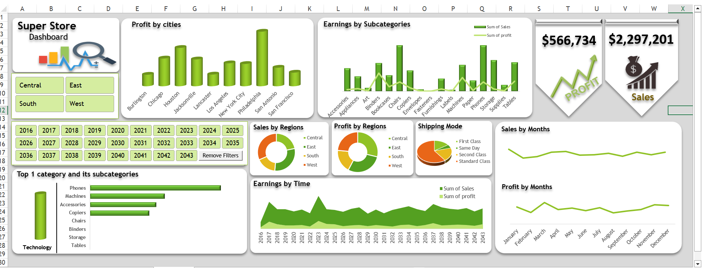
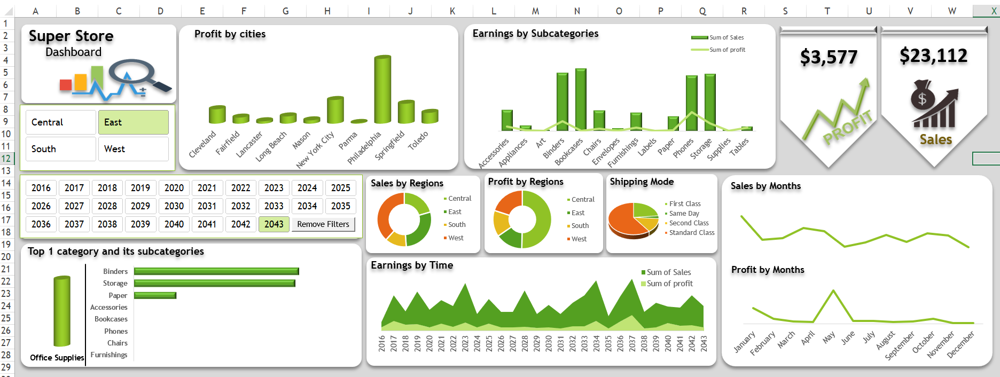

# 📊 Superstore Sales Excel Dashboard  

This project presents a **dynamic Excel dashboard** built on the **Superstore dataset** to analyze sales and profit across different dimensions.  

The dashboard provides an interactive and visual summary of business performance using multiple chart types.  

---

## 🚀 Features of the Dashboard  

### 🔹 Charts & Visuals  
- **Column Chart (Profit by Cities):**  
  Displays profits distributed across major cities to identify top- and low-performing areas.  

- **Combo Chart (Columns with Line – Earnings by Subcategories):**  
  Shows earnings per subcategory with a line overlay for trend analysis.  

- **Doughnut Charts (Profit & Sales by Region):**  
  Two separate doughnuts to compare sales and profit contribution from each region.  

- **Pie Chart (Shipping Modes):**  
  Illustrates the share of different shipping modes used in fulfilling orders.  

- **Filled Line Chart (Earnings by Time):**  
  Highlights earnings trends over time with area-style lines.  

- **Dual Line Chart (Profit & Sales by Months):**  
  Two separate lines displayed in one card to compare monthly profit vs. sales performance.  

- **Top Category Card:**  
  Shows the **Top 1 Category** based on sales.  

- **Subcategories Bar Chart (in the same card):**  
  Breaks down the subcategories under the top-performing category for deeper insights.  

---

## 🎯 Purpose  
The dashboard is designed to help businesses:  
- Track profitability by region, city, and category.  
- Analyze trends in sales and profit over time.  
- Identify best-performing shipping modes.  
- Quickly spot top categories and subcategories for strategic decision-making.  

---

## Screenshots

## 🖼️ Preview  
(Add a screenshot or sni
